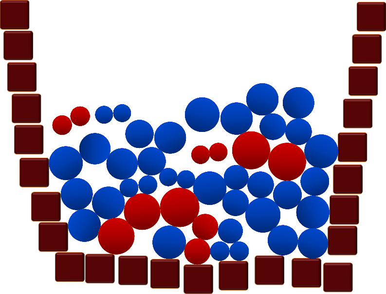

# Cells

Code for my game/demonstration on the AMOLF Open Dag on October 5, 2019.

The goal is to keep the system stable for as long as possible. The system consists of red and blue cells, and you need them both. If you have no red or blue cells remaining, or the system overflows, the game ends.

Red cells are dividing cells, so they will divide into either two red cells, or two blue cells. Blue cells do not divide, and will just die after a while. On the bottom right of the screen, you can set the chance for a red cell to divide into blue or red cells and you can set the lifetime of blue cells.

Good luck finding a balance!

## Running (instructions for Windows)
Download Godot 3.1 and place the EXE file in the project folder (so in the same folder as this README file). Double-click the EXE to run the game.

## Developing (cross-platform)
This is a Godot project (version 3.1), so just install Godot and load this directory.

## Extra materials
During the open day, we also used a paper for instructions (to be printed at A4), a paper with a scoreboard (to be printed at A3) and a poster (to be printed at A0). You can find them in the [documentation folder](./documentation/).
